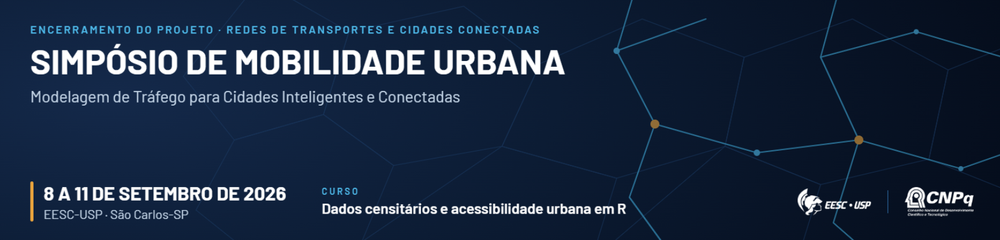

# Apresentação {.unnumbered}

{.banner-evento fig-alt="Simpósio de Mobilidade Urbana, EESC-USP, São Carlos-SP, 8 a 11 de setembro de 2026. Curso: Dados censitários e acessibilidade urbana em R"}

Este site reúne o material prático do workshop **Dados Censitários e Acessibilidade Urbana em R**, oferecida no **Simpósio de Mobilidade Urbana**, evento de encerramento do projeto Redes de Transportes e Cidades Conectadas, realizado na EESC-USP, em São Carlos-SP, entre 8 e 11 de setembro de 2026.

O objetivo do workshop é mostrar como obter e explorar os principais produtos do Censo Demográfico e produzir análises de acessibilidade urbana utilizando o R. Na primeira parte, trabalharemos com os principais produtos do Censo, incluindo agregados por setor censitário, microdados da amostra, grade estatística e CNEFE, sobretudo os resultados com implicações importantes para a pesquisa em transportes. Posteriormente, computaremos medidas de acessibilidade urbana, que combinam a distribuição das oportunidades no território com o desempenho da rede de transportes. 

## Como a oficina está organizada {.unnumbered}

São 8 horas de atividade, divididas em dois blocos de 4 horas. Cada bloco tem 2 horas expositivas e
2 horas de aplicação prática ao computador.

| Bloco | Teoria (2h) | Prática (2h) |
|---|---|---|
| Dados censitários | Conceitos, métodos e produtos do Censo Demográfico | Parte 1 deste site (capítulos 1 a 6) |
| Acessibilidade urbana | Conceitos, medidas e usos em planejamento | Parte 2 deste site (capítulos 7 a 10) |

**Este material cobre apenas as partes práticas**, e o conteúdo teórico é apresentado em sala, com material próprio. O que está aqui é o roteiro de código, pensado para ser acompanhado ao vivo e, depois, reexecutado por conta própria.

A **Parte 1** percorre os principais produtos do Censo Demográfico, começando pela preparação do ambiente e pelos recortes territoriais do IBGE e avançando pelos agregados por setor censitário, pelos microdados da amostra, pelo CNEFE e pela grade estatística. Os agregados incluem uma seção dedicada às características urbanísticas do entorno dos domicílios, com recorte voltado a
transportes.

A **Parte 2** monta uma análise de acessibilidade do zero, com a preparação do ambiente de roteamento, a leitura dos insumos e a construção da rede multimodal, o cálculo dos indicadores a pé, de bicicleta, de carro e por transporte público e, por fim, a avaliação da distribuição social dessa acessibilidade, com medidas de desigualdade e de pobreza de acesso.

## O estudo de caso {.unnumbered}

Todas as aplicações usam **Anápolis-GO** como território de referência. A escolha de um município de porte médio é deliberada. Os arquivos são pequenos o bastante para que cada etapa rode em poucos minutos em um notebook comum, condição necessária para uma prática de 2 horas, e grandes o suficiente para que os padrões territoriais apareçam com clareza nos mapas.

Usar o mesmo município nas duas Partes também tem uma razão didática. Os dados populacionais produzidos na Parte 1 são exatamente os insumos consumidos na Parte 2, de modo que o participante percorre o caminho completo, do arquivo bruto do IBGE ao mapa de acessibilidade.

## Pré-requisitos {.unnumbered}

A oficina supõe familiaridade básica com R, incluindo o básico da linguagem e análise exploratória de dados (sobretudo com os pacotes `dplyr` e `ggplot2`), além de noções de geoprocessamento.

Quem quiser chegar mais preparado pode consultar estes materiais.

- @pedreira_censo_2026, para os fundamentos de R aplicados a dados tabulares e geográficos e para o detalhamento dos produtos do Censo tratados na Parte 1.
- @pereira_herszenhut_2023, para a fundamentação conceitual e computacional das medidas de acessibilidade tratadas na Parte 2.

## Antes do evento {.unnumbered}

::: {.callout-important}
## Instale tudo antes de chegar

As instalações consomem tempo e dependem de conexão estável. Faça a preparação em casa, com antecedência, para não gastar a prática configurando *software*. Os capítulos [1](1-instalacao.qmd) e [7](7-instalacao-r5r.qmd) trazem o passo a passo completo, incluindo a instalação do Java exigida pelo pacote `r5r`.
:::

Em resumo, será necessário ter instalados o R, o RStudio, um Java compatível com o `r5r` e os pacotes de R usados nas duas Partes. Os capítulos de instalação detalham cada item e trazem um teste de verificação do ambiente.

## Onde ficam os dados {.unnumbered}

Parte dos dados é obtida em tempo real pelos pacotes `censobr` e `geobr`, sem necessidade de arquivos locais. Os arquivos que **não** são produzidos por código, como a rede viária do OpenStreetMap, o GTFS e o modelo de elevação, são distribuídos como *assets* de um [*release*](https://github.com/pedreirajr/workshop_censo_acc_smu2026/releases/tag/dados) do repositório da oficina e baixados pelo próprio código dos capítulos, para dentro do projeto do RStudio.

## Instrutores {.unnumbered}

::: {.instrutores}

::: {.instrutor}
### Jorge Ubirajara Pedreira Junior {.unnumbered}

Professor da Universidade Federal da Bahia (UFBA), atua no ensino e pesquisa em planejamento de transportes e desenvolve soluções para R, a exemplo dos pacotes {cnefetools}, {tripdistmodels} e {geohazards}. Autor de *Censo Demográfico no R*.
[Página pessoal](https://pedreirajr.github.io/website/) |[lattes](http://lattes.cnpq.br/7602862678306492)
:::

::: {.instrutor}
### Thiago Vinícius Louro {.unnumbered}

<!-- COMPLETAR: minibio do Thiago (vínculo institucional, áreas de atuação, link) -->
:::

::: {.instrutor}
### Lucas Brandão Monteiro de Assis {.unnumbered}

<!-- COMPLETAR: minibio do Lucas (vínculo institucional, áreas de atuação, link) -->
:::

:::
